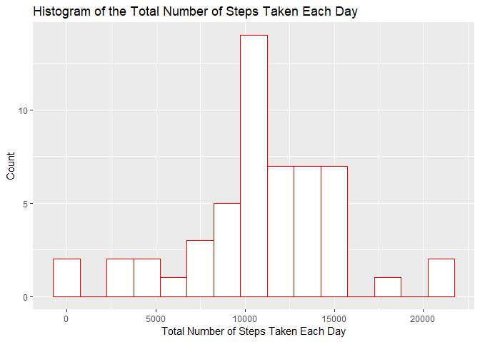

## 1. Loading and preprocessing the data

```r
# Setting working directory
# setwd("~/Projetos em R/Coursera Reproducible Research/Week 2")
data <- read.csv("activity.csv", header=TRUE, na.strings="NA")
data <- transform(data, date = as.Date(date))
head(data)
```

```
##   steps       date interval
## 1    NA 2012-10-01        0
## 2    NA 2012-10-01        5
## 3    NA 2012-10-01       10
## 4    NA 2012-10-01       15
## 5    NA 2012-10-01       20
## 6    NA 2012-10-01       25
```

## 2. Getting the mean total number of steps taken per day
### 2.1. Calculating the total number of steps taken per day

```r
steps <- aggregate(data$steps, by=list(Date=data$date), FUN=sum)
names(steps)[names(steps) == "x"] <- "Total"
head(steps)
```

```
##         Date Total
## 1 2012-10-01    NA
## 2 2012-10-02   126
## 3 2012-10-03 11352
## 4 2012-10-04 12116
## 5 2012-10-05 13294
## 6 2012-10-06 15420
```

### 2.2. Making a histogram of the total number of steps taken each day

```r
library(ggplot2)
```

```
## Registered S3 methods overwritten by 'ggplot2':
##   method         from 
##   [.quosures     rlang
##   c.quosures     rlang
##   print.quosures rlang
```

```r
hist <- ggplot(data=na.omit(steps), aes(Total)) +
  geom_histogram(binwidth=1500, colour="red", fill="white") + 
  xlab("Total Number of Steps Taken Each Day") +
  ylab("Count") +
  ggtitle("Histogram of the Total Number of Steps Taken Each Day")
print(hist)
```

<!-- -->

### 2.3. Calculating and reporting the mean and median of the total number of steps taken per day

```r
mean(na.omit(steps$Total))
```

```
## [1] 10766.19
```

```r
median(na.omit(steps$Total))
```

```
## [1] 10765
```

## 3. Getting the average daily activity pattern
